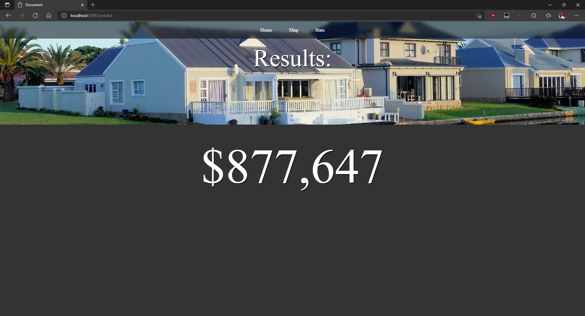

# Austin House Prices

## Summary  
The User will be asked to input housing features and click submit, which will send all the data through a machine learning algorithm to get the resulting housing price. The dashboard also includes a tab to display a map where houses can be selected to look at their features and prices. Another tab includes stats where graphs and plots can be viewed.

## Members  
Ajaypal Paneser (Solo)  

## Youtube Video
https://www.youtube.com/watch?v=j_DazBmM_Uc

## Dataset Used
https://www.kaggle.com/ericpierce/austinhousingprices/tasks?taskId=4044

## Database
I used postgresql/PGAdmin for the database. The Databasae was split into 4 tables: house_features, house_info, house_location, house_school. 


## Machine Learning Algorithm
For the machine learning algorithm, I used Gradient Boosting Regressor to calculate the House prices from the inputs. The columns from the database I used are hometype, hasgarage, yearbuilt, zipcode, latest_saleyear, lotsizesqft, livingareasqft, numofbathrooms, numofbedrooms, numofstories, avgschooldistance. All non-numerical values were converted to nnumerical and some unnecessary data was cleaned. I was able to get a 73% accuracy score, though the accuracy tended to fluctuate from 60%-70% via other random states. 

``` python
def predict(hometype, hasgarage, 
yearbuilt, zipcode, lotsizesqft, livingareasqft, 
numofbathrooms, numofbedrooms, numofstories, avgschooldistance):
    # import from database
    connection = psycopg2.connect(user="postgres", password=db_password, host="localhost", port="5432", database="AustinHomes")
    query = "SELECT * FROM house_info INNER JOIN house_location ON house_info.zpid = house_location.zpid INNER JOIN house_school ON house_location.zpid = house_school.zpid"
    a_sales_df = pd.read_sql(query, connection)

    # create copy for use with the machine learning model
    ml_data = a_sales_df.loc[a_sales_df['city'] == "austin"].copy()

    # use only the columns that will be used in the model
    ml_data = ml_data[['hometype', 'hasgarage', 'yearbuilt', 'latestprice', 'zipcode', 
                    'latest_saleyear', 'lotsizesqft', 'livingareasqft', 'numofbathrooms', 
                    'numofbedrooms', 'numofstories', 'avgschooldistance']]

    # Clean unnecessary data
    ml_data = ml_data.loc[ml_data['numofbedrooms'] != 0]
    ml_data = ml_data.loc[ml_data['numofbedrooms'] < 11]
    ml_data = ml_data.loc[ml_data['numofbathrooms'] < 11]
    ml_data = ml_data.loc[ml_data['hometype'] != 'Other']
    ml_data = ml_data.loc[ml_data['hometype'] != 'Vacant Land']
    ml_data = ml_data.loc[ml_data['lotsizesqft'] < (ml_data['lotsizesqft'].max()*.001)]


    X = ml_data.drop("latestprice", axis=1)
    y = ml_data['latestprice']

    # convert home types into numbers
    home_type = {
        'Single Family': 0, 
        'Residential': 1,
        'Mobile / Manufactured': 2,
        'Townhouse': 3,
        'Condo': 4,
        'Vacant Land': 5,
        'Multiple Occupancy': 6,
        'Other': 7,
        'Apartment': 8,
        'MultiFamily': 9
    }

    X['hometype'] = X['hometype'].apply(lambda x: home_type[x])

    # change the rest into numerical datatypes as well
    le = LabelEncoder()
    X['hasgarage'] = le.fit_transform(X['hasgarage'])

    # split data into training and testing sets
    X_train, X_test, y_train, y_test = train_test_split(X, y, random_state=2)

    clf = GradientBoostingRegressor(n_estimators=400, max_depth=5, min_samples_split=2, learning_rate=.1, loss='squared_error')
    clf.fit(X_train, y_train)
    print("Accuracy Score: ", clf.score(X_test, y_test))
    result = clf.predict([[hometype, hasgarage, yearbuilt, zipcode, 2021, lotsizesqft, 
    livingareasqft, numofbathrooms, numofbedrooms, numofstories, avgschooldistance]])

    return result
```

## Dashboard
I used HTML and Javascript along with Flask in python to create the dashboard for this project. I put 3 tabs as part of the UI: Home, Map, and Stats. The home tab is where the main inputs are located for the machin Learning Algorithm. The map section uses mapbox to display some of the homes with their information when you click on them. the stats tab contains visualizations created in tableau.

### Home  
This is where the user posts all the information:


### Predicting
I've used the request method from flask to get the entered data in the form from the home page and put each value into a variable to use with the function for the machine learning algorithm. the prediction results are sent to results.html which displays the data

``` python
@app.route('/predict',methods=['POST'])
def prediction():
    # Get the data from the POST request.
    if request.method == "POST":
        print('valuecheck: ' + request.form["home-type"])
        hometype = int(request.form["home-type"])
        hasgarage = int(request.form["hasgarage"])
        yearbuilt = int(request.form["yearbuilt"])
        zipcode = int(request.form["zipcode"])
        lotsizesqft = request.form["lotsizesqft"]
        livingareasqft = int(request.form["livingareasqft"])
        numofbathrooms = float(request.form["numofbathrooms"])
        numofbedrooms = int(request.form["numofbedrooms"])
        numofstories = int(request.form["numofstories"])
        avgschooldistance = int(request.form["avgschooldistance"])

        prediction = '${0:,.0f}'.format(predict(hometype, hasgarage, yearbuilt, zipcode, lotsizesqft, 
        livingareasqft, numofbathrooms, numofbedrooms, numofstories, avgschooldistance)[0])

        print(prediction)
        return render_template("results.html", results=prediction)
```

### Results
This is the result screen, with the results of the inputs shown above displayed below:  



### Map
The map displays a random 500 homes with information about the home with prices when you click on them


### Stats
This page shows visualizations made via tableau that show how much certain values affect the price of a home and also some things that may not have been necessary


## Things I would have wanted to add
* After receiving the results, I would have wanted to display similar homes to what the user searched for on the map. due to not having enough time, I wasn't able to work on this and ended up showing random homes on the map
* Some choices in the app may may need to be reduced, like choosing from a range of values for the YearBuilt attribute instead of selecting individual years of about 120 years
* another choice that could have been reduced is the zipcode attribute. It may have been more useful to convert zipcodes into counties rather than choosing from a large amount of zipcodes. I had added an option to not submit a zipcode as it may be too much information
